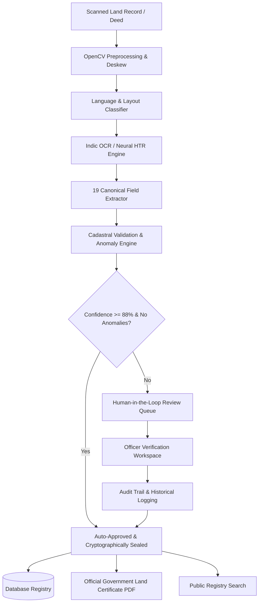

<div align="center">

# 🏛️ LandSure AI
### Intelligent Multilingual Land Record Digitization & Cadastral Validation Platform
**Smart India Hackathon (SIH) • Problem Statement SIH26018**

[](https://landsure-tech.vercel.app)
[](https://sih26018-land-digitization.onrender.com)
[](https://sih26018-land-digitization.onrender.com/docs)
[](LICENSE)

</div>

---

## 🌐 Live Production Deployments

| Component | Platform | URL |
| :--- | :--- | :--- |
| **Frontend Web Portal** | **Vercel** | [https://landsure-tech.vercel.app](https://landsure-tech.vercel.app) |
| **Backend REST API** | **Render** | [https://sih26018-land-digitization.onrender.com](https://sih26018-land-digitization.onrender.com) |
| **Interactive API Documentation** | **Swagger / OpenAPI** | [https://sih26018-land-digitization.onrender.com/docs](https://sih26018-land-digitization.onrender.com/docs) |
| **Alternative Frontend Mirror** | **Vercel** | [https://sih-26018-land-digitization.vercel.app](https://sih-26018-land-digitization.vercel.app) |

---

## 🔑 Demo Access Credentials

| Role | Username | Password | Access Scope |
| :--- | :--- | :--- | :--- |
| **Revenue Officer** | `revenue_officer` | `sih2026password` | Document Upload, Verification Queue, Field Editing, Certificate Issuance |
| **System Administrator** | `admin` | `sih2026admin` | Full Cadastral Audit Logs, System Diagnostics, Global Registry Management |

---

## 📌 Executive Summary & Problem Context

Historical and legacy Indian land records (Pattas, ROR-1B / Adangal extracts, Sale Deeds, Mutation registers, and Cadastral village survey sheets) are frequently preserved as physical paper archives or degraded scanned images in various **Indic languages** (Telugu, Tamil, Hindi, Kannada, Marathi, Gujarati, Odia, English).

**LandSure AI** provides an end-to-end, automated, and human-in-the-loop digitization pipeline aligning with the **Digital India Land Records Modernization Programme (DILRMP)** standards:
- **Computer Vision Preprocessing**: CLAHE contrast enhancement, deskewing, noise filtering, and adaptive thresholding binarization.
- **Multilingual Neural OCR**: Deep neural text recognition across 8 Indian languages and scripts.
- **19-Field Canonical Revenue Schema**: Automated extraction of critical cadastral attributes (Pattadar names, survey/khasra numbers, khata, plot, area extents, boundary extents, mutation references).
- **Rule-Based Anomaly Detection**: Real-time cross-referencing for area discrepancies, ownership conflicts, duplicate entries, and boundary integrity.
- **Interactive Verification Workspace**: Side-by-side verification console with native script overlays and single-click cryptographic sealing.
- **Cryptographic Land Certificates**: Automated PDF generation featuring digital revenue seals and SHA-256 integrity verification hashes.

---

## 🏗️ System Architecture & Workflow



---

## ⚡ Technology Stack

### Frontend Client:
- **Framework**: React 18 with Vite
- **Styling**: Tailwind CSS, Lucide Icons
- **HTTP Client**: Axios (with JWT interceptors)
- **Deployment**: Vercel Edge Network (Global CDN)

### Backend Services:
- **API Framework**: FastAPI (Python 3.11) with Uvicorn ASGI
- **Computer Vision**: OpenCV (Headless), Pillow, NumPy
- **OCR Engine**: RapidOCR (ONNX Neural Engine), PyTesseract (Tesseract 5 Indic Models)
- **PDF & Certificate Engine**: ReportLab, PyMuPDF, PyPDF
- **Database & ORM**: SQLAlchemy 2.0, SQLite / PostgreSQL
- **Security & Auth**: OAuth2 Password Flow, PyJWT, Passlib, Cryptography
- **Deployment**: Docker Container on Render Cloud Platform

---

## 👥 Development Team

| Name | Role & Specialization | Profiles |
| :--- | :--- | :--- |
| **Nikhil Appari** | **Team Lead & Full-Stack Architect**<br/>FastAPI Backend, React Frontend, Authentication, Cloud Deployments | [](https://github.com/nikhilappari/) [](https://www.linkedin.com/in/nikhil-appari-365810309/) |
| **Hemanth Birda** | **AI / ML & Indic OCR Lead**<br/>Multilingual Neural Character Recognition & Handwriting Extraction | — |
| **Sai Naidu Yalla** | **Computer Vision & Preprocessing Engineer**<br/>CLAHE Enhancement, Deskewing, Noise Filtering & Boundary Analysis | — |
| **Poojitha Bellam** | **Backend & Cadastral Database Architect**<br/>SQLAlchemy Data Models, Registry Query Engine & PDF Certificate Generation | — |
| **Kalyani Bondi** | **Frontend & UI/UX Specialist**<br/>Responsive Design, Verification Workspace & Modern Glassmorphic Interfaces | — |
| **Madhavi Nakka** | **Security & GIS QA Engineer**<br/>Cadastral Anomaly Rules, Audit Trail Integrity & Cross-Validation Logic | — |

---

## 🚀 Local Development Setup

If you wish to run the system locally on your development machine:

### Prerequisites:
- Python 3.10+
- Node.js 18+ & npm
- Git

### 1. Clone the Repository:
```bash
git clone https://github.com/nikhilappari/SIH26018-Land-Digitization.git
cd SIH26018-Land-Digitization
```

### 2. Backend Setup:
```bash
cd backend
python -m venv venv

# Windows:
venv\Scripts\activate
# Linux/macOS:
source venv/bin/activate

pip install -r requirements.txt
python -m uvicorn app.main:app --host 127.0.0.1 --port 8000 --reload
```
*Backend API docs available at: [http://127.0.0.1:8000/docs](http://127.0.0.1:8000/docs)*

### 3. Frontend Setup:
```bash
cd ../frontend
npm install
npm run dev
```
*Frontend Portal running at: [http://localhost:3000](http://localhost:3000)*

---

## 📜 License & Compliance

Distributed under the **MIT License**. Compliant with **DILRMP (Digital India Land Records Modernization Programme)** standards for secure digital governance.
